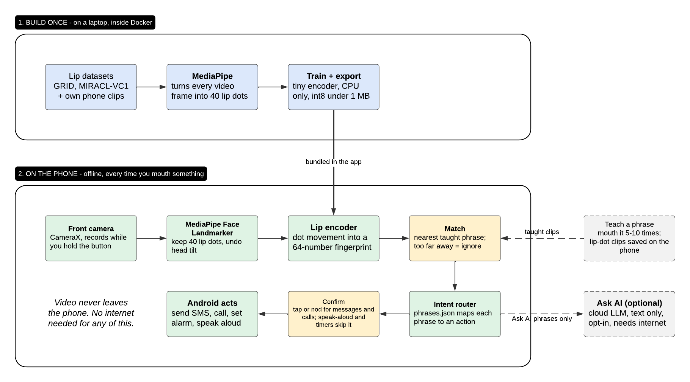
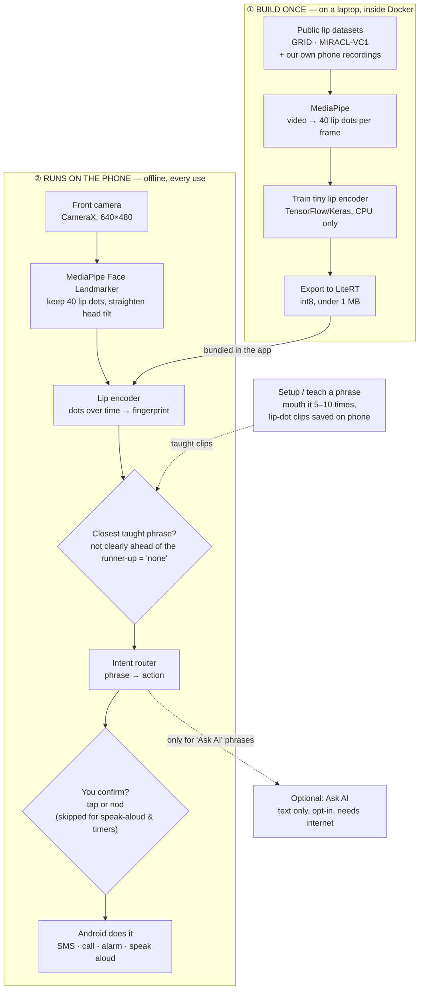

# Hush — Architecture

> One sentence: **the phone turns your lips into ~40 dots, a tiny model turns the dots' movement into a fingerprint, and the fingerprint is matched against phrases *you* taught it.** No video leaves the phone, no GPU, no internet.

Every decision below is logged with its reason in [DECISION_LOG.md](DECISION_LOG.md).

---

## 1. The picture

**Lucidchart (editable):** https://lucid.app/lucidchart/dc2ec5a7-4a0f-421c-b8a2-756113a81fb5/edit



Same diagram as Mermaid (renders on GitHub, lives with the code):



Read it top to bottom: **① is done once by us** (training). **② is what happens every time a user mouths something.** The dotted lines are side paths.

## 2. The flow in plain words

| Step | What happens | Where | Cost on a cheap phone |
|---|---|---|---|
| 1. Hold button | Push-to-talk starts the camera | Phone | — |
| 2. Face dots | MediaPipe puts 478 points on the face; we keep the 40 lip points, centre them on the mouth, scale by mouth width, undo head tilt | Phone | ~15–30 fps, the heaviest step |
| 3. Fingerprint | Tiny 1D-CNN reads the dot movement (up to 2 s) and outputs 64 numbers | Phone | ~5 ms, under 1 MB |
| 4. Match | Compare to the fingerprints saved during setup. Nearest wins, but only if it is clearly closer than the second-best phrase (best ÷ second ≤ ratio, user-tunable, D-46); otherwise "none of these" (ignores chewing/smiling) | Phone | microseconds |
| 5. Route | `phrases.json` says what each phrase does ("call Dad" → dial contact Dad) | Phone | — |
| 6. Confirm | Messages, calls, Emergency: shows "Call Dad?", tap or nod (nod comes from the same face dots, free). **Speak-aloud and timers skip this** and show "tap to stop/undo" instead | Phone | — |
| 7. Act | Android intents: SMS, dial, alarm, TextToSpeech | Phone | — |

**Teaching a new phrase = mouthing it 5–10 times.** No retraining: the app saves those mouthings as cleaned lip-dot sequences and turns them into fingerprints when it starts, so a model update never forces re-teaching (D-37). That's why it works offline and on weak phones.

### Latency budget (from letting go of the button)

| Step | Low-end phone (estimate, to be measured) |
|---|---|
| Lip dots | ~0 ms extra — computed *while* you mouth; only the last frame remains (~30–50 ms) |
| Encoder + match | ~5 ms |
| Suggestion on screen | **~50–100 ms total** |
| Human confirm (tap / nod) | 300–1000 ms ← the real bottleneck. **Skipped for speak-aloud & timers → those finish in ~0.1–0.3 s** |
| Action fires | 10–300 ms (direct SMS/call APIs; TTS pre-warmed) |

Speed rules: camera, MediaPipe and TTS start when the app opens (no cold start on button press); push-to-talk release is the end-of-speech signal (no waiting for silence); actions use direct APIs, not "open another app".

## 3. Tech stack

| Layer | Choice | Why this one |
|---|---|---|
| App | **Kotlin + CameraX**, minSdk 24 (Android 7.0) | Native, no extra runtime; camera frames go straight to MediaPipe. MediaPipe Tasks needs API 24+ |
| Face dots | **MediaPipe Face Landmarker** (`tasks-vision`) | Free, on-device, ~3.7 MB model, same tool in training and app so dots match exactly |
| Lip model | **1D temporal CNN** on lip dots, ~350k params, 64-d output | Dots instead of pixels = ~100× less input. Conv layers quantize cleanly to int8 (GRUs don't) |
| On-phone runtime | **LiteRT** (TensorFlow Lite), int8 | Small, fast on CPU, works on every Android phone |
| Training | **Python 3.11, TensorFlow/Keras (CPU), MediaPipe** | Model is tiny → CPU is enough; Keras has the LiteRT (`.tflite`) converter and int8 quantization built in — one framework from training to phone |
| Personalisation | **Nearest-fingerprint matching** (prototypes) | Teaching = storing vectors, not training. Zero extra battery, instant |
| Agent / actions | **Deterministic router** (`phrases.json`) + **Android intents** | Closed phrase set → the phrase *is* the intent. No LLM needed for the core |
| Speak aloud | **Android TextToSpeech** | Built in, offline voices |
| Storage | One JSON file in app-private storage | Taught dot sequences, ~4 MB for 30 phrases (D-37). No database needed |
| Ask AI (optional) | Cloud LLM, **text only**, opt-in | The only thing that touches the internet |
| Build | **Docker** (one `Dockerfile`, targets `train` and `android`) | Anyone can train and build the APK with no local setup |

**Target device:** Android 7+, 2 GB RAM, any front camera. Lip model under 1 MB (doc target was 10 MB).

**Face model (pinned, D-39):** `https://storage.googleapis.com/mediapipe-models/face_landmarker/face_landmarker/float16/1/face_landmarker.task`, sha256 `64184e229b263107bc2b804c6625db1341ff2bb731874b0bcc2fe6544e0bc9ff`. Training reads it from `data/models/`; the app bundles the same file.

## 4. Datasets

The model learns *"how lips move"* from public data, then learns *your* phrases from your setup recordings.

| Dataset | What's in it | Licence | Our use | Priority |
|---|---|---|---|---|
| **[GRID](https://zenodo.org/records/3625687)** | 33 speakers (s21 missing) × 1000 sentences, frontal, fixed grammar. Video + word alignments only, no audio (D-42) | CC BY 4.0 (confirmed on Zenodo) | **Start here and main pretraining** (D-40). Instant download, no agreement, even commercial-friendly | Week 1 |
| **MIRACL-VC1** | 15 speakers, 10 words + 10 phrases, 10 reps each | Research (Kaggle [`apoorvwatsky/miraclvc1`](https://www.kaggle.com/datasets/apoorvwatsky/miraclvc1), 6.3 GB, licence listed as unknown) | Matches our setup exactly (few reps per phrase) → few-shot test | Week 1 |
| **Hush own recordings** | 30 phrases + junk clips × 5+ people, on real phones, handheld, varied light ([training/RECORDING.md](training/RECORDING.md)) | Ours, with written consent (D-43) | **Most important** — it's the real conditions. Also the only path to a commercial launch | Week 1 onwards |
| LRS3 (TED) | 400+ h free sentences | CC BY-NC-ND | Only if sentence mode is ever built | Later |

**Not using:** OuluVS2 (research request form, likely the same signature problem; MIRACL + own data cover phrases, handheld recordings cover angles, D-41), [LRW](https://www.robots.ox.ac.uk/~vgg/data/lip_reading/lrw1.html) and LRS2 (BBC agreement needs a staff signature at a research institution; not available for a school project, D-40), VoxCeleb2 (unlabelled — self-supervised pretraining is overkill for 30 phrases), AVSpeech (no transcripts).

**Training recipe (short):** run MediaPipe over every clip once and cache the dots (`.npy`) → train the encoder to classify GRID words → fine-tune so the same phrase from the same person lands close together (prototypical episodes on MIRACL/own data) → int8 export. Augment with speed changes (15–30 fps phones), small rotations and dropped frames.

Rough cost: extracting dots from GRID ≈ 2.5M frames ≈ 1 h on 12 CPU cores. Training the encoder: minutes to an hour on CPU.

## 5. Why this architecture

1. **Dots, not pixels.** Pixel lip-readers (Auto-AVSR etc.) are 100M+ parameters and need a GPU. 40 dots × 2 coords per frame is a tiny input, so the model can be tiny. MediaPipe already does the hard vision work and is optimised for cheap phones.
2. **Closed phrase set, matched to your own face.** The doc's own numbers say free sentences are ~20% wrong even for research giants. 30–50 personal phrases is solvable on a cheap phone, and it removes the "m/b/p look alike" problem — we match whole phrases, not letters.
3. **Fingerprints, not on-phone training.** Teaching a phrase only stores vectors. No backprop on the phone, no battery drain, works on a 2 GB phone.
4. **No LLM in the core loop.** With a closed set the phrase already *is* the intent. An LLM would add hundreds of MB (on-device) or the internet (cloud) to solve a problem we've designed away.
5. **Confirm before anything that leaves the phone.** Messages, calls and Emergency always need a tap or nod. Speak-aloud and timers run instantly (with one-tap stop/undo), because speed matters most there and a mistake is harmless and easy to undo.

## 6. Self-critique — weak spots I'm knowingly accepting

| Weak spot | Honest impact | Mitigation |
|---|---|---|
| **Closed set can't do free questions.** Doc demo "What is photosynthesis?" won't work as free speech | The "Ask AI" feature is limited to questions you've taught as phrases | For the demo, teach that question as a phrase and say so. Free sentences = later, opt-in, server-side |
| **Dots lose info** (tongue, teeth visibility) that pixels have | Lower ceiling than pixel models on large vocabularies | Irrelevant for 30–50 personal phrases; revisit only if accuracy stalls below 90% |
| **MediaPipe is the bottleneck on very weak phones** (~10–15 fps) | Fewer frames per phrase | Train with frame-rate augmentation; lower camera resolution; tune the "none" threshold in settings |
| **No LRW** (D-40): GRID is the only large pretraining set, and it has 33 speakers, frontal only | Less variety of faces, angles and lighting than LRW's hundreds of speakers | Own recordings cover real conditions; strong augmentation (rotation, speed, dropped frames); if the encoder still can't beat DTW, ship DTW |
| **Contacts are bound at teaching time** ("call Dad" is one phrase) | Can't say "call <anyone>" | Fine for v1; a contact-name slot is a v2 problem |
| **Dataset licences are research-only** (except GRID & own data) | Can't ship commercially as-is | Own recordings + GRID are the commercial path |
| **No confirm for speak-aloud & timers** | A misread phrase can be spoken aloud wrong; the spec's "zero wrong actions" target now applies only to messages, calls and Emergency | One tap stops speech / cancels the timer; nothing irreversible (send, call) ever skips confirm |
| **Day-1 baseline might already be "good enough"** | Neural encoder could be wasted effort | Build a DTW (template-matching, zero training) baseline first. The encoder must beat it to earn its place |

## 7. Approaches considered and rejected

| Alternative | Why not |
|---|---|
| **Pixel-based lip reading** (Auto-AVSR, ResNet+Conformer on mouth crops) | 100M+ params, hundreds of MB, needs a GPU-class phone. Breaks "any low-spec phone" |
| **Run the model in the cloud** | Sends face video off the phone (privacy), needs internet, costs money per user. Breaks two core promises |
| **On-device LLM agent** (e.g. 1B-param model) | 500 MB+ and 4 GB+ RAM. Not needed with a closed phrase set (§5.4) |
| **Cloud LLM to fix misread words** (doc's "mob → Mom") | Closed-set matching never produces "mob" in the first place. Keep the LLM only for opt-in Ask AI |
| **Flutter / React Native** | Extra runtime (several MB), per-frame camera data crossing a bridge. iOS is a stretch goal; we pay for it if/when it comes |
| **GRU/LSTM model** | int8 quantization of recurrent layers is patchy in LiteRT; 1D-CNN is faster and quantizes cleanly |
| **Training on the phone for personalisation** | Complex, slow, battery-heavy. Saving fingerprints gives the same "teach a phrase" UX for free |
| **PyTorch + litert-torch** | Converter pulls in JAX + TensorFlow anyway: first Docker image was 3.8 GB for a <1 MB model. Keras exports to LiteRT natively |
| **ONNX Runtime Mobile** | Works, but LiteRT is smaller on Android and shares Google's tooling with MediaPipe |
| **Eyebrow-raise trigger** | Cute but error-prone. Push-to-talk first; add later if users ask |
| **A database (Room/SQLite)** | We store a few MB of dot sequences. One JSON file |

## 8. Planned project layout

```
Hush/
├── ARCHITECTURE.md      ← this file
├── DECISION_LOG.md      ← every decision + why
├── Dockerfile           ← targets: train, android
├── training/            ← Python: extract dots, train, export .tflite
├── app/                 ← Android (Kotlin) app
└── data/                ← datasets + cached dots (git-ignored)
```

Folders are created when their first real file is written (no empty scaffolding).

## 9. Running it (Docker)

```bash
docker build --target train   -t hush-train   .
docker build --target android -t hush-android .

docker run --rm -v "$PWD":/hush hush-train   python training/train.py
docker run --rm -v "$PWD":/hush hush-android ./gradlew assembleRelease
```

Source is mounted, not copied — change code, re-run, no rebuild.
